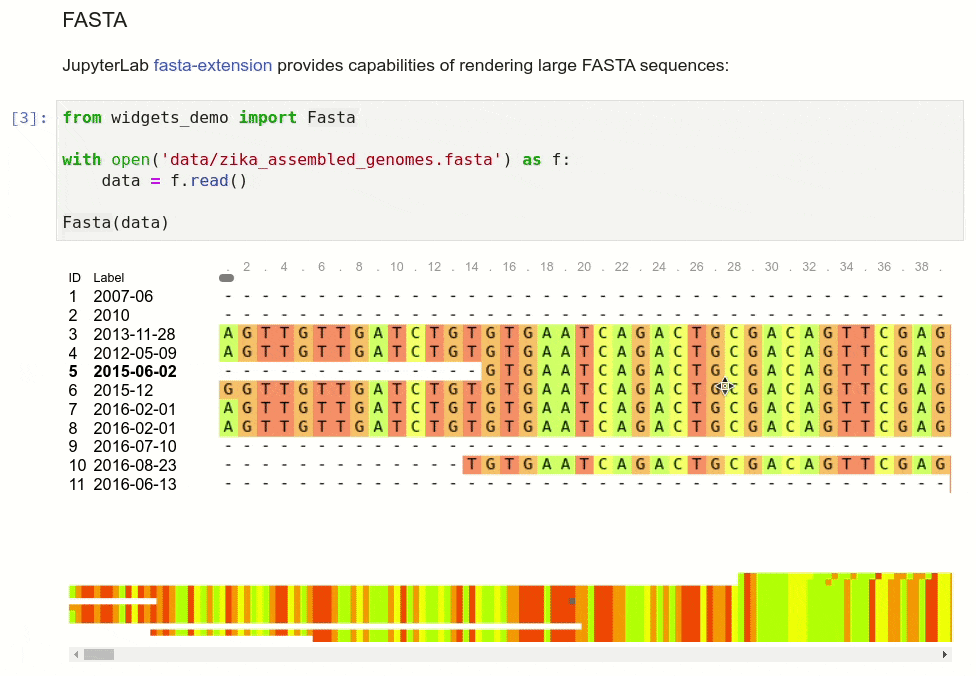
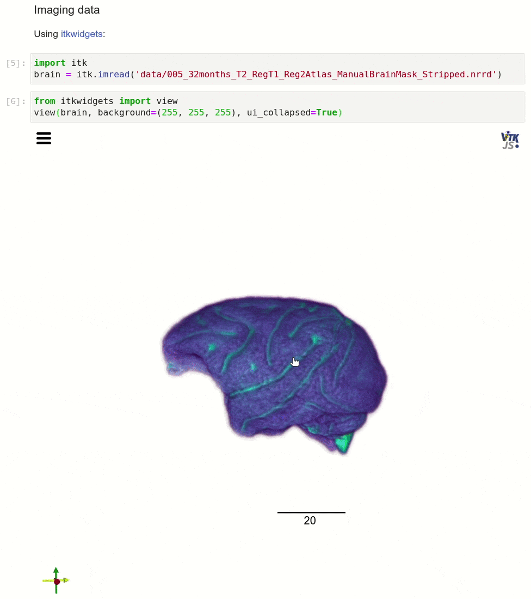
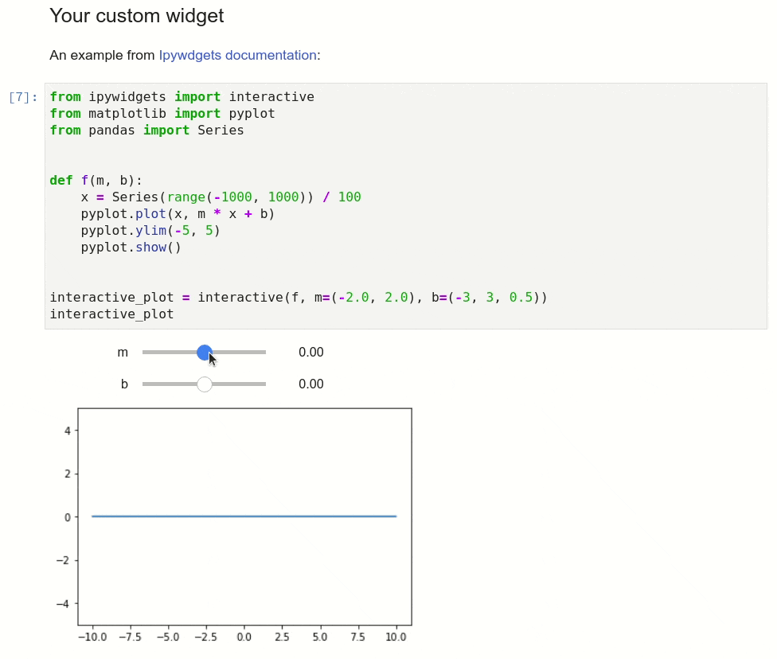

# Computational notebooks for biomedical research

The slides are available as a notebook on GitHub [`Overview.ipynb`](./Overview.ipynb). Complimentary (opinionated) slides are available in other notebooks.

Run the notebooks with examples online:

- For Jupyter notebook: `Examples_Jupyter_notebook.ipynb`  (JupyterLab)
- For R Markdown: `Examples_R_Markdown.Rmd`  (RStudio)

The online environments may take some time (>10 minutes) to boot up if they are run after a fresh commit or for a first time in a while.

### Widgets screencast

For your convenience sreencasts of widgets which may be of use for biomedical researchers are embedded below:

### About

This talk was given during an [NGSeminar](https://ngschool.eu/ngseminars/) on the use of Jupyter and R notebooks in biomedical research, available to [watch on YouTube](https://www.youtube.com/watch?v=eXt4MROqTtc) and later, in an improved version for the Big Data Institute training session.

### Dependencies

The Python packages used in the seminar and demonstration are listed in the [`environment.yml`](./environment.yml) file. You can install them with conda, or install specific Python requirements with pip.

The JupyterLab extensions used are listed in the `postBuild` file. You can install them by copy-pasting the line which starts with `jupyter labextension install`. In this file you will  also find the instructions on downloading the example datasets used in the presentation.
